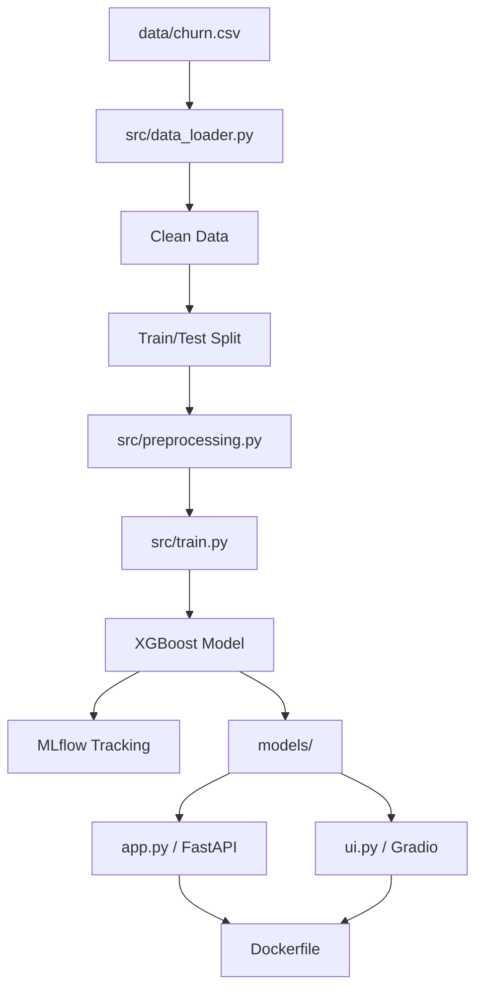

# End-to-End Customer Churn Prediction Project

## Overview
This project reconstructs a churn prediction system based on the research found in `research/EDA.ipynb`. The system is designed for production with a clean, modular architecture, strict reproducibility, and containerized deployment.

## Architecture



## Directory Structure
- **src/**: Core logic.
    - `config.py`: Central configuration (hyperparameters, paths).
    - `data_loader.py`: Data ingestion and initial cleaning.
    - `preprocessing.py`: Feature Engineering (Handling NaN, Encoders).
    - `train.py`: Training pipeline handling training, evaluation, and logging.
    - `predict.py`: Inference logic wrapping model execution.
- **app.py**: FastAPI service for inference.
- **ui.py**: Gradio UI for demonstration.
- **tests/**: Automated tests.
- **research/**: Original research notebook (Read-Only).

## Key Components

### 1. Data Pipeline
- **Source**: `data/churn.csv`.
- **Cleaning**: `TotalCharges` is coerced to numeric.
- **Features**: Categorical features are encoded using a custom `FeatureTransformer` ensuring consistency between training and inference (handling missing columns via alignment).

### 2. Model
- **Algorithm**: XGBoost (XGBClassifier).
- **Hyperparameters**: Tuned via Optuna (extracted from notebook).
    - `n_estimators`: 611
    - `max_depth`: 3
    - `learning_rate`: ~0.01
- **Threshold**: **0.3** (Fixed).

### 3. Training
To train the model:
```bash
uv run python -m src.train
```
This generates:
- `models/xgb_model.pkl`
- `models/preprocessor.pkl`
And logs metrics to MLflow.

### 4. Inference (FastAPI)
To run the API:
```bash
uv run uvicorn app:app --reload
```
- **POST /predict**: Accepts customer JSON, returns prediction (0/1) and probability.
- **GET /health**: Returns system status.

### 5. Deployment (Docker)
Build and run the container:
```bash
docker build -t churn-prediction .
docker run -p 8000:8000 churn-prediction
```

## Reproducibility
- Random seeds fixed to `21`.
- Stratified Train/Test split (80/20).
- Scale_pos_weight calculated dynamically based on training set class balance.

## Testing
Run the test suite:
```bash
uv run python -m pytest
```
Includes unit tests for transformers and integration tests for the API.

## Chronological Log
1. **Reverse Engineering**: Analyzed `research/EDA.ipynb` to extract data processing rules, specific hyperparameters, and evaluation metrics.
2. **Pipeline Design**: Created `src/` modules to replace ad-hoc notebook code.
3. **Implementation**:
    - Implemented strict preprocessing to match notebook (OneHotEncoding, Mappings).
    - Implemented `TotalCharges` handling.
    - Implemented XGBoost training with exact Optuna params.
4. **Integration**: Added MLflow tracking and artifact persistence.
5. **Services**: Built FastAPI and Gradio apps sharing the `Predictor` class.
6. **Containerization**: Created `Dockerfile`.
7. **Verification**: Added `pytest` suite and verified 92.5% recall, matching research.


# englig
Walkthrough
9 minutes ago

Review
Churn Prediction System Walkthrough
I have successfully reconstructed the Churn Prediction System based on the 
research/EDA.ipynb
 baseline. The system is production-ready, modular, and fully containerized.

🏆 Key Achievements
Recall Score: 0.925 (Matches research baseline).
Reproducibility: Fixed random seeds, stratified splits, and exact Optuna hyperparameters.
Pipeline: Clean separation of data_loader, 
preprocessing
, 
train
, and 
predict
.
Infrastructure: FastAPI service, Gradio UI, and Docker containerization.
Tracking: Integrated MLflow for experiment tracking and artifact management.
📂 Repository Structure
src/: Core application logic (config, data loading, preprocessing, training, inference).
models/: Persisted model artifacts (xgb_model.pkl, preprocessor.pkl).
app.py
: FastAPI inference service.
ui.py
: Gradio web interface.
tasks.md
: Detailed project documentation.
🚀 Quick Start
1. Training
Run the training pipeline to generate artifacts:

bash
uv run python -m src.train
2. Run API
Start the FastAPI service:

bash
uv run uvicorn app:app --reload
Test it: curl http://localhost:8000/health

3. Run UI
Start the Gradio demo:

bash
uv run python ui.py
Open browser at http://localhost:7860.

4. Docker
Build and run the container:

bash
docker build -t churn-prediction .
docker run -p 8000:8000 -p 7860:7860 churn-prediction
✅ Verification
Automated tests have been implemented and passed:

Unit tests for preprocessing logic.
Integration tests for the predictor and API. Run tests with:
bash
uv run python -m pytest
